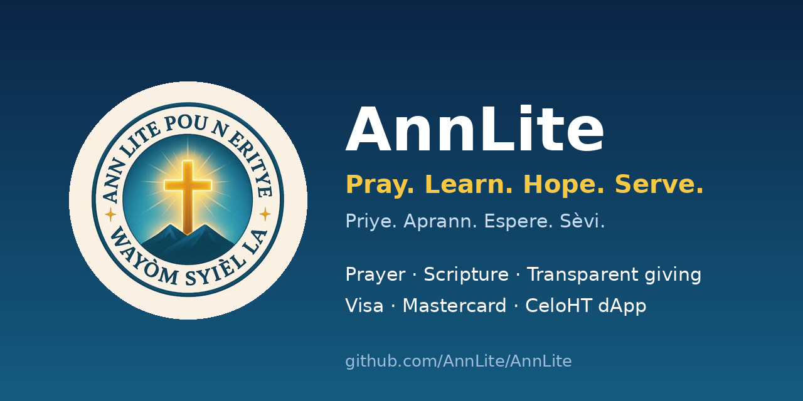

  

<h1 align="center">Ann Lite</h1>

<b>Pray. Learn. Hope. Serve.</b> <i>Priye. Aprann. Espere. Sèvi.</i>

  
  
  
  

**Ann Lite** is a Christian platform for **prayer, Bible reading, reflection and transparent charitable giving** — in Haitian Creole, French and English. Founded by **Berline Britus**, from Haiti.

> We never promise salvation or a place in heaven in exchange for using the platform or donating.

## 🌍 What we're building
- 🙏 **Prayer & reflections** — Christian content with an editorial publishing workflow
- 📖 **Bible & learning** — Scripture and education, only where legally permitted
- 🤝 **Charitable giving** — supporting vulnerable children, orphans and elders
- 🔍 **Transparency** — public donation feed and on-chain verification for crypto gifts

## 💳 Payment channels
| Channel | Details |
|---|---|
| **CeloHT dApp** | CELO and USDm, verified on-chain by our backend |
| **Visa** | via a card provider — no raw card data stored |
| **Mastercard** | via a card provider — no raw card data stored |

## 📦 Repositories
| Repository | Purpose |
|---|---|
| [**AnnLite/AnnLite**](https://github.com/AnnLite/AnnLite) | The complete platform monorepo: web, mobile, admin, backend, database, content, payments, design system, security, infrastructure, tests and docs |
| [**AnnLite/.github**](https://github.com/AnnLite/.github) | This organization profile and community-health defaults |

## 🚦 Status
**Pre-production.** No live card provider is connected yet, and our Celo smart contract is **not yet audited** (not for mainnet). We state only what is verified — see the [main README](https://github.com/AnnLite/AnnLite#status) for exact status.

## 🤲 Get involved
- Read the [Contributing guide](https://github.com/AnnLite/.github/blob/main/CONTRIBUTING.md) and [Code of Conduct](https://github.com/AnnLite/.github/blob/main/CODE_OF_CONDUCT.md)
- Report vulnerabilities **privately** — see [SECURITY.md](https://github.com/AnnLite/.github/blob/main/SECURITY.md)
- Need help? See [SUPPORT.md](https://github.com/AnnLite/.github/blob/main/SUPPORT.md)
- Review our open-source [license](https://github.com/AnnLite/.github/blob/main/LICENSE)

🌐 [annlite.com](https://annlite.com) · 🇭🇹 Haiti
